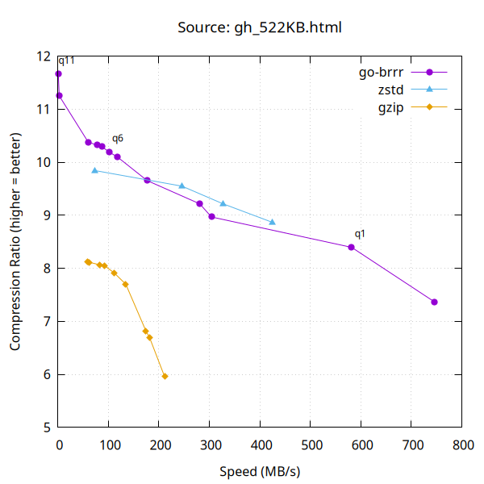
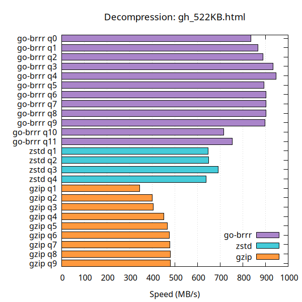
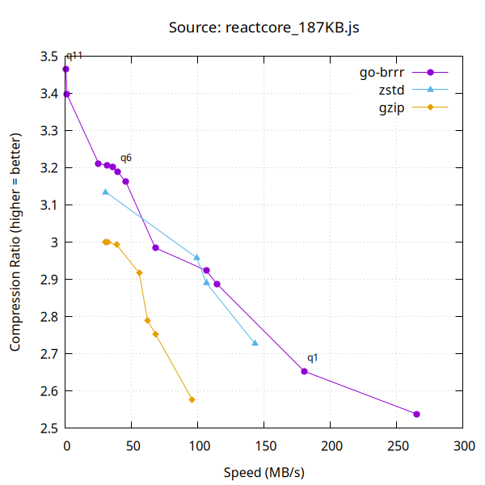
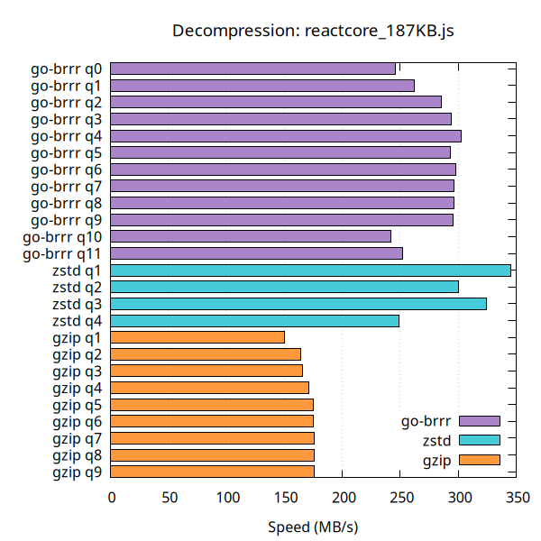
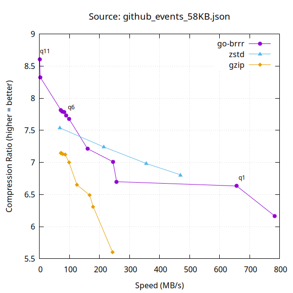
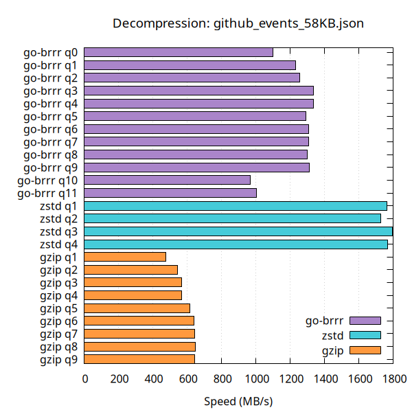

# go-brrr

Pure Go implementation of the Brotli compression algorithm.

## Install

```sh
go get github.com/molecule-man/go-brrr
```

```go
import "github.com/molecule-man/go-brrr"
```

The import path is `github.com/molecule-man/go-brrr`; the package name is `brrr`.

## Examples

### Round-trip compression and decompression

[embedmd]:# (example_test.go go /func Example_roundtrip/ /^}/)
```go
func Example_roundtrip() {
	// Compress
	original := []byte("Hello, brotli! This is a round-trip compression example.")
	var compressed bytes.Buffer
	w, err := brrr.NewWriter(&compressed, 6)
	if err != nil {
		log.Fatal(err)
	}
	if _, err := w.Write(original); err != nil {
		log.Fatal(err)
	}
	if err := w.Close(); err != nil {
		log.Fatal(err)
	}

	// Decompress
	r := brrr.NewReader(&compressed)
	decompressed, err := io.ReadAll(r)
	if err != nil {
		log.Fatal(err)
	}
	fmt.Println(string(decompressed))
	// Output: Hello, brotli! This is a round-trip compression example.
}
```

### One-shot decompression

[embedmd]:# (example_test.go go /func Example_decompress/ /^}/)
```go
func Example_decompress() {
	// Compress some data first.
	original := []byte("Decompress restores the original bytes from a brotli-compressed slice.")
	var compressed bytes.Buffer
	w, err := brrr.NewWriter(&compressed, 4)
	if err != nil {
		log.Fatal(err)
	}
	if _, err = w.Write(original); err != nil {
		log.Fatal(err)
	}
	if err = w.Close(); err != nil {
		log.Fatal(err)
	}

	// One-shot decompression from a byte slice.
	result, err := brrr.Decompress(compressed.Bytes())
	if err != nil {
		log.Fatal(err)
	}
	fmt.Println(string(result))
	// Output: Decompress restores the original bytes from a brotli-compressed slice.
}
```

### Reusing Writer and Reader

[embedmd]:# (example_test.go go /func Example_reuse/ /^}/)
```go
func Example_reuse() {
	// Reset lets you reuse a Writer and Reader across multiple payloads,
	// avoiding repeated allocations.
	payloads := []string{
		"First payload: the quick brown fox jumps over the lazy dog.",
		"Second payload: pack my box with five dozen liquor jugs.",
	}

	var compressed bytes.Buffer
	w, err := brrr.NewWriter(&compressed, 4)
	if err != nil {
		log.Fatal(err)
	}
	r := brrr.NewReader(nil)

	for _, payload := range payloads {
		// Compress
		compressed.Reset()
		w.Reset(&compressed)
		if _, err := w.Write([]byte(payload)); err != nil {
			log.Fatal(err)
		}
		if err := w.Close(); err != nil {
			log.Fatal(err)
		}

		// Decompress
		r.Reset(&compressed)
		result, err := io.ReadAll(r)
		if err != nil {
			log.Fatal(err)
		}
		fmt.Println(string(result))
	}
	// Output:
	// First payload: the quick brown fox jumps over the lazy dog.
	// Second payload: pack my box with five dozen liquor jugs.
}
```

### Pooling Writers and Readers

When you compress or decompress repeatedly - per-request in a webserver, per-message in a stream processor, per-record in a batch job - allocating a fresh `*brrr.Writer` or `*brrr.Reader` each time wastes work on encoder hash tables, decoder ring buffers, and scratch buffers. Keep them in `sync.Pool`s and `Reset` each instance into the next stream.

[embedmd]:# (example_test.go go /func Example_pool/ /^}/)
```go
func Example_pool() {
	// For repeated compression and decompression (e.g. per-request in an
	// HTTP server, per-message in a stream processor), keep *brrr.Writer
	// and *brrr.Reader instances in sync.Pools. Get, Reset, use, Put back.
	// This avoids allocating encoder hash tables and decoder ring buffers
	// each time.
	writerPool := sync.Pool{
		New: func() any {
			w, err := brrr.NewWriter(io.Discard, 5)
			if err != nil {
				// NewWriter only fails for an invalid level, which is
				// static here.
				panic(err)
			}
			return w
		},
	}
	readerPool := sync.Pool{
		New: func() any { return brrr.NewReader(nil) },
	}

	compress := func(dst io.Writer, payload []byte) error {
		w := writerPool.Get().(*brrr.Writer)
		defer writerPool.Put(w)

		w.Reset(dst)
		if _, err := w.Write(payload); err != nil {
			return err
		}
		return w.Close()
	}

	decompress := func(src io.Reader) ([]byte, error) {
		r := readerPool.Get().(*brrr.Reader)
		defer readerPool.Put(r)

		r.Reset(src)
		return io.ReadAll(r)
	}

	payloads := []string{
		"First response body.",
		"Second response body.",
	}
	for _, p := range payloads {
		var buf bytes.Buffer
		if err := compress(&buf, []byte(p)); err != nil {
			log.Fatal(err)
		}
		out, err := decompress(&buf)
		if err != nil {
			log.Fatal(err)
		}
		fmt.Println(string(out))
	}
	// Output:
	// First response body.
	// Second response body.
}
```

### Compound dictionary

[embedmd]:# (example_test.go go /func Example_compoundDictionary/ /^}/)
```go
func Example_compoundDictionary() {
	// A compound dictionary supplies extra reference data that both the
	// encoder and decoder can use for backward references. This is useful
	// when compressing data that shares content with a known corpus.
	dict := []byte(strings.Repeat("common dictionary content that appears in many documents. ", 50))
	input := []byte("This document references common dictionary content that appears in many documents. " +
		"It benefits from the shared dictionary because repeated phrases compress better.")

	// Compress with compound dictionary.
	var compressed bytes.Buffer
	w, err := brrr.NewWriter(&compressed, 4)
	if err != nil {
		log.Fatal(err)
	}
	if err := w.AttachDictionary(dict); err != nil {
		log.Fatal(err)
	}
	if _, err := w.Write(input); err != nil {
		log.Fatal(err)
	}
	if err := w.Close(); err != nil {
		log.Fatal(err)
	}

	// Decompress with the same compound dictionary.
	r := brrr.NewReader(&compressed)
	if err := r.AttachDictionary(dict); err != nil {
		log.Fatal(err)
	}
	result, err := io.ReadAll(r)
	if err != nil {
		log.Fatal(err)
	}
	fmt.Println(string(result))
	// Output: This document references common dictionary content that appears in many documents. It benefits from the shared dictionary because repeated phrases compress better.
}
```

## When to use go-brrr

The best use case for brotli is **static asset compression** - CSS, JS, HTML, fonts, WASM - where you compress once at build time and serve the result millions of times. Use **quality 11** for this: speed doesn't matter because you pay the cost once, and brotli q11 delivers ratios that neither gzip nor zstd can match. Every browser shipped since 2016 supports `Content-Encoding: br`.

For on-the-fly compression, brotli q5–6 is a strong choice if you're already using zstd at its highest level: q5 is often **faster** with a **better ratio**, and q6 is only slightly slower with an even better ratio. At lower compression levels, zstd is significantly faster - if throughput is your priority and you don't need the best ratio, zstd is the better tool for the job.

If you compress or decompress repeatedly (e.g. per request in a webserver), keep `*brrr.Writer` and `*brrr.Reader` instances in `sync.Pool`s and `Reset` each one into the next stream rather than allocating new instances each time. See the [pooling example](#pooling-writers-and-readers) below.

## A note on the code

Don't expect idiomatic Go. The library is tuned for throughput first, and the source reflects that:

- giant functions that would normally be split up,
- duplicated loops where a shared helper would force a slow path,
- hand-specialized code for hot shapes,
- APIs structured around escape analysis and inlining rather than aesthetics.

If something looks oddly written, it's almost always deliberate - measured against benchmarks and kept because the "cleaner" version was slower.

## Acknowledgments

This library is a port of the [Brotli reference implementation](https://github.com/google/brotli) by the Brotli Authors, licensed under the MIT License.

## Compression Speed vs Ratio

All benchmarks were taken on the following setup:

```
goos: linux
goarch: amd64
cpu: AMD Ryzen 5 7535HS with Radeon Graphics
```

Compared against [klauspost/compress](https://github.com/klauspost/compress) zstd (pure Go) and stdlib gzip. Single CPU, no parallelism.

| Compression | Decompression |
|---|---|
|  |  |
|  |  |
|  |  |

## Benchmarks

Compared against pure Go brotli libraries. **go-brrr** is the base in all comparisons. The smaller the number the better.

- **andybalholm** - [github.com/andybalholm/brotli](https://github.com/andybalholm/brotli), another pure Go brotli implementation.
- **brotli-ref** - the [original C implementation](https://github.com/google/brotli) by Google, called via cgo. Included as a reference point; note that this is a naive cgo wrapper calling into the C library without any Go-side optimizations.
- **cbrotli** - [github.com/google/brotli/go/cbrotli](https://github.com/google/brotli/go/cbrotli), Google's official cgo bindings. Including a cgo library in a pure Go comparison isn't apples-to-apples, but it provides a useful ceiling for how fast brotli can go with C under the hood.

### Compression

<!-- bench:compress -->
| | go-brrr (sec/op) | andybalholm (sec/op) |
| --- | --- | --- |
| Compress/q=0/payload=VariedPayloads | 6.211m ± 1% | 8.255m ± 0%  +32.91% (p=0.002 n=6) |
| Compress/q=1/payload=VariedPayloads | 8.990m ± 1% | 11.888m ± 0%  +32.23% (p=0.002 n=6) |
| Compress/q=2/payload=VariedPayloads | 12.17m ± 0% | 21.33m ± 1%  +75.33% (p=0.002 n=6) |
| Compress/q=3/payload=VariedPayloads | 13.39m ± 1% | 25.50m ± 0%  +90.44% (p=0.002 n=6) |
| Compress/q=4/payload=VariedPayloads | 21.13m ± 1% | 35.03m ± 0%  +65.77% (p=0.002 n=6) |
| Compress/q=5/payload=VariedPayloads | 31.21m ± 0% | 47.45m ± 0%  +52.06% (p=0.002 n=6) |
| Compress/q=6/payload=VariedPayloads | 34.66m ± 1% | 54.83m ± 0%  +58.16% (p=0.002 n=6) |
| Compress/q=7/payload=VariedPayloads | 44.25m ± 1% | 70.99m ± 1%  +60.43% (p=0.002 n=6) |
| Compress/q=8/payload=VariedPayloads | 51.63m ± 1% | 83.50m ± 1%  +61.72% (p=0.002 n=6) |
| Compress/q=9/payload=VariedPayloads | 68.15m ± 1% | 107.83m ± 1%  +58.23% (p=0.002 n=6) |
| Compress/q=10/payload=VariedPayloads | 881.6m ± 0% | 930.1m ± 1%   +5.49% (p=0.002 n=6) |
| Compress/q=11/payload=VariedPayloads | 2.213 ± 0% | 2.390 ± 0%   +8.02% (p=0.002 n=6) |
| **geomean** | 44.67m | 66.06m       +47.89% |
<!-- /bench:compress -->

*Streaming* uses `brrr.NewReader` + `io.ReadAll`; *one-shot* uses `brrr.Decompress` on a complete in-memory blob.

### Streaming Decompression

<!-- bench:decompress -->
| | go-brrr (sec/op) | andybalholm (sec/op) |
| --- | --- | --- |
| Decompress/q=4/payload=VariedPayloads | 3.909m ± 0% | 6.974m ± 0%  +78.38% (p=0.000 n=12) |
| Decompress/q=5/payload=VariedPayloads | 3.848m ± 0% | 6.689m ± 0%  +73.81% (p=0.000 n=12) |
| Decompress/q=6/payload=VariedPayloads | 3.737m ± 0% | 6.486m ± 0%  +73.57% (p=0.000 n=12) |
| Decompress/q=11/payload=VariedPayloads | 4.068m ± 0% | 6.484m ± 0%  +59.40% (p=0.000 n=12) |
| **geomean** | 3.889m | 6.655m       +71.14% |
<!-- /bench:decompress -->

### One-shot Decompression

<!-- bench:decompresso -->
| | go-brrr (sec/op) | andybalholm (sec/op) | brotli-ref (sec/op) | cbrotli (sec/op) |
| --- | --- | --- | --- | --- |
| DecompressOneshot/q=4/payload=VariedPayloads | 3.993m ± 0% | 7.353m ± 1%  +84.14% (p=0.000 n=12) | 7.748m ± 1%  +94.05% (p=0.000 n=12) | 3.661m ± 1%  -8.31% (p=0.000 n=12) |
| DecompressOneshot/q=5/payload=VariedPayloads | 3.980m ± 0% | 7.044m ± 1%  +76.97% (p=0.000 n=12) | 7.658m ± 1%  +92.39% (p=0.000 n=12) | 3.586m ± 1%  -9.91% (p=0.000 n=12) |
| DecompressOneshot/q=6/payload=VariedPayloads | 3.850m ± 0% | 6.781m ± 1%  +76.15% (p=0.000 n=12) | 7.454m ± 1%  +93.61% (p=0.000 n=12) | 3.544m ± 2%  -7.94% (p=0.000 n=12) |
| DecompressOneshot/q=11/payload=VariedPayloads | 4.149m ± 0% | 6.939m ± 2%  +67.25% (p=0.000 n=12) | 4.079m ± 1%  -1.69% (p=0.005 n=12) |
| **geomean** | 3.992m | 7.026m       +76.03% | 7.619m       +93.35%                ¹ | 3.712m       -7.01% |

¹ benchmark set differs from baseline; geomeans may not be comparable
<!-- /bench:decompresso -->


The `VariedPayloads` benchmark rotates through a heterogeneous mix of files, guarding against benchmark-shaped optimizations - wins that only show up when the same input is fed back-to-back should not move these rows. Payloads span small JSON API responses, mid-size HTML and JS bundles, and larger English prose, drawn from the [Brotli reference test corpus](https://github.com/google/brotli/tree/master/tests/testdata) and the local [testdata/](testdata/) directory.

| File                  | Size   | Source     |
|-----------------------|-------:|------------|
| github_events_2k.json | 2.2 KB | testdata   |
| github_events_5k.json | 5.2 KB | testdata   |
| github_events_8k.json | 8.3 KB | testdata   |
| asyoulik.txt          | 122 KB | brotli-ref |
| alice29.txt           | 149 KB | brotli-ref |
| gh_172KB.html         | 167 KB | testdata   |
| reactcore_187KB.js    | 182 KB | testdata   |
| lcet10.txt            | 417 KB | brotli-ref |
| plrabn12.txt          | 471 KB | brotli-ref |
